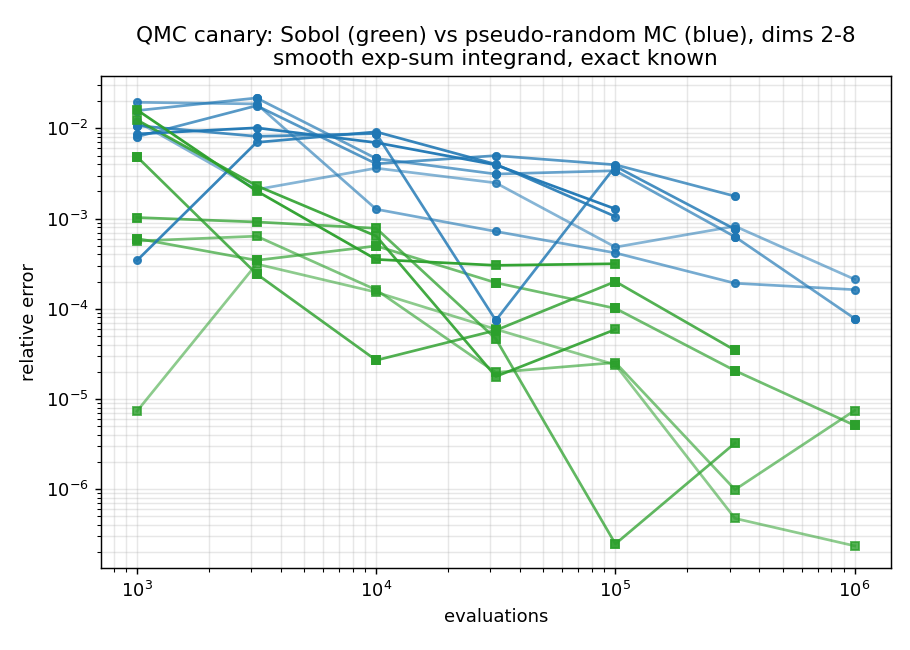
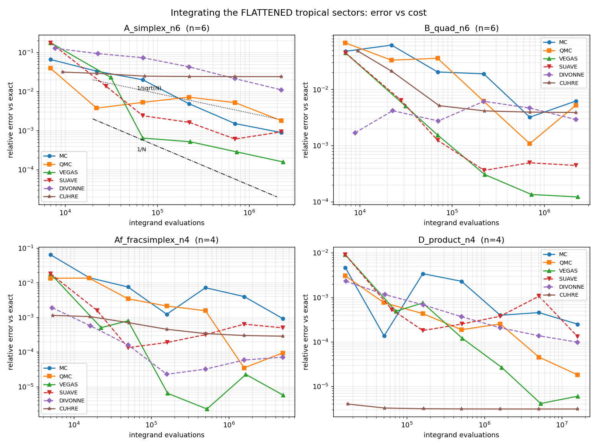
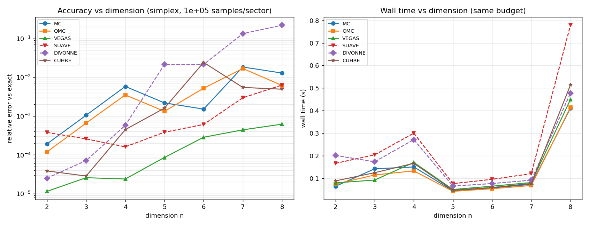

# Choosing the sampler for the flattened tropical integrand: MC vs. QMC vs. CUBA

*A benchmark report. Generated under `TEST/`; reproduces from
`gen_sectors.wl → run.sh → analyze.py → plots.py`.*

---

## Executive summary

The Tropical Monte Carlo v2 pipeline turns a convergent generalized Euler
integral into a sum of per‑sector integrals that are **bounded and $O(1)$ on the
unit cube $[0,1]^n$**, then estimates each with **plain uniform Monte Carlo**.
This report asks the natural follow‑up: *given those already‑flattened sectors,
is it faster to use quasi‑Monte Carlo, or to hand them to an adaptive library
like CUBA?* I tested 15 higher‑dimensional convergent integrands ($n=2\ldots8$,
four families, each with an exact closed form), feeding **the identical
flattened sector functions** to six samplers.

**Findings.**

1. **Plain MC is the weakest method** and should be replaced — textbook
   $1/\sqrt N$, occasionally worse, with an over‑optimistic error bar on
   heavy‑ish sectors.
2. **CUBA‑Vegas is the overall winner**: best accuracy‑per‑evaluation in *every*
   one of the 15 cases, an empirical rate $p\approx1.0$–$1.7$ that **does not
   degrade with dimension**, and the only method that reaches $10^{-3}$ relative
   error in all cases (including $n=8$). Its per‑evaluation cost is within ~2× of
   MC, so the 1–2 orders of magnitude in accuracy are essentially free.
3. **Randomized Sobol QMC is the best *dependency‑light* upgrade** over MC
   (rate $p\approx0.6$–$0.9$, ≈1 order of magnitude better), but its margin
   **erodes as $n$ grows**.
4. **Cuhre (deterministic cubature) is conditionally excellent**: unbeatable
   ($\sim10^{-7}$) when flattening leaves a *smooth* integrand, but mediocre
   otherwise. The deciding factor is **integrand smoothness, which flattening
   does *not* guarantee** — see §6.
5. **Divonne can be silently, confidently wrong** on these integrands (22 %
   error at $n=8$ while five other methods agree on the exact value). Avoid it.

**Recommendation.** Adopt **CUBA‑Vegas (Sobol, `seed=0`)** as the sector
integrator; keep **randomized Sobol QMC** as the no‑dependency fallback; use
**Cuhre only when all effective exponents $a_{\mathrm{eff}}$ are integers** and
$n$ is modest; do not use Divonne here.

---

## 1. Background

After Steps 1–4 of the algorithm (manual §6), the integral is the exact sum

$$ I=\sum_\sigma \frac{|\det M_\sigma|}{\prod_j a^\sigma_j}\int_{[0,1]^n}\!\! d^n y'\;\prod_k Q^\sigma_k\!\big({y'}^{1/a^\sigma}\big)^{B_k}, $$

where each summand is "a smooth, bounded, $O(1)$ function on the unit cube — by
design the ideal target for plain uniform Monte Carlo" (manual §6.7). The
shipped C++ (`GenerateCppMonteCarlo`) samples each sector with
`std::mt19937_64` + Welford statistics. This report keeps the left‑hand side of
that equation fixed and varies only how the **right‑hand side integrals** are
estimated.

Note the existing CUBA cross‑checks in the package (`cuba_common.wl`,
`tropical_eval_examples3.wl`) integrate the **original, un‑decomposed** integrand
via a $x_i=t_i/(1-t_i)$ compactification — a correctness check, not this
question. Here CUBA (and QMC) act on the **post‑flattening** sectors.

---

## 2. Experimental design

### 2.1 Test integrands

All convergent, numeric, parameter‑free, with an analytic reference value, and
generated by the *real* pipeline (`ProcessSector` / `GenerateCppMonteCarlo`).
The fan is the scale‑invariant normal fan; a thin‑lattice‑simplex workaround was
needed (see §8).

| Family | Integrand $\displaystyle\int_{[0,\infty)^n}\!\!\prod_i x_i^{A_i}\,P^{B}\,d^nx$ | $n$ | sectors | exact value |
|---|---|---|---|---|
| **A** — simplex | $P=1+\sum_i x_i,\;A_i=0,\;B=-(n{+}2)$ | 2,3,4,5,6,7,8 | $n{+}1$ | $1/(n{+}1)!$ |
| **Af** — fractional simplex | $P=1+\sum_i x_i,\;A_i=-\tfrac12,\;B=-(n{+}1)$ | 2,4,6 | $n{+}1$ | $\pi^{n/2}\,\Gamma(\tfrac n2{+}1)/n!$ |
| **B** — quadratic | $P=1+\sum_i x_i^2,\;A_i=0,\;B=-(n{+}1)$ | 4,6 | $n{+}1$ | $2^{-n}\pi^{n/2}\,\Gamma(\tfrac n2{+}1)/n!$ |
| **D** — product | $P=\prod_i(1{+}x_i),\;A_i=0,\;B=-2$ | 3,4,5 | $2^{n}$ | $1$ |

Family **A** is the clean dimension‑scaling spine (exact $1/(n{+}1)!$, $n{+}1$
sectors). **Af** introduces genuine $x^{-1/2}$ edge singularities that exercise
the flattening. **B** gives a different integrand shape and factor‑2 ray maps.
**D** has a Newton‑polytope = hypercube, hence **$2^n$ sectors**, stress‑testing
both sector count and the per‑sector overhead of the library routines.

### 2.2 Methods (all single‑threaded, identical integrands)

| tag | description |
|---|---|
| **MC** | plain pseudo‑random uniform MC (`mt19937_64`), Welford — *the shipped pipeline* |
| **QMC** | randomized quasi‑MC: **Boost `sobol`** (Joe–Kuo direction numbers) + 16 independent Cranley–Patterson random shifts → unbiased estimate with a real error bar |
| **VEGAS** | CUBA Vegas — adaptive importance sampling on Sobol low‑discrepancy points (`seed=0`) |
| **SUAVE** | CUBA Suave — subregion‑adaptive importance sampling |
| **DIVONNE** | CUBA Divonne — stratified sampling / region splitting (peak finder) |
| **CUHRE** | CUBA Cuhre — deterministic globally‑adaptive polynomial cubature |

### 2.3 Metric & fairness

For each method I sweep a per‑sector budget $N\in\{10^3,\,10^{3.5},\dots,10^6\}$,
sum the sectors, and compute the **true** relative error against the analytic
reference (not the method's self‑reported error). Budgets mean *samples per
sector* (MC/QMC) and *maxeval per sector* (CUBA). I record total integrand
evaluations and wall time. Everything is single‑threaded with
`cubacores(0,0)` so the comparison is per‑core; note MC/QMC parallelize
trivially over kinematic points exactly as the current pipeline does.

A built‑in **QMC canary** integrates a known smooth function $e^{\sum_i y_i}$
(exact $(e-1)^n$) to verify the Sobol generator actually delivers
low‑discrepancy convergence before trusting any conclusion.

---

## 3. Decomposition correctness (cross‑method agreement)

At the top budget, five independent samplers agree with the exact value in every
case; the lone outlier is Divonne. Example — the hardest case, `A_simplex_n8`
(exact $=1/9!=2.75573\times10^{-6}$):

| method | estimate | rel. error |
|---|---|---|
| MC | 2.72035e‑6 | 1.28e‑2 |
| QMC | 2.77275e‑6 | 6.18e‑3 |
| **VEGAS** | **2.75743e‑6** | **6.18e‑4** |
| SUAVE | 2.73838e‑6 | 6.30e‑3 |
| DIVONNE | 2.15019e‑6 | **2.20e‑1** ⚠ |
| CUHRE | 2.74215e‑6 | 4.93e‑3 |

Five methods bracket the exact value → the tropical decomposition + flattening
is correct; Divonne's 22 % miss is a *method* failure, not a decomposition
error. No NaN/Inf occurred anywhere in the 769‑row dataset.

---

## 4. The QMC generator works (canary)

Integrating the smooth $e^{\sum y_i}$, the log‑log convergence slopes are:

| $n$ | MC slope | QMC slope |
|--:|--:|--:|
| 2 | −0.50 | −0.78 |
| 3 | −0.76 | −0.86 |
| 4 | −0.72 | −0.67 |
| 5 | −0.30 | −1.40 |
| 6 | −0.50 | −0.61 |
| 7 | +0.15 | −1.35 |
| 8 | −0.42 | −0.85 |

MC hugs the theoretical $-0.5$ (noisy at a single seed); **Sobol QMC is
consistently steeper**, confirming the generator delivers genuine
low‑discrepancy behavior on a smooth integrand.



---

## 5. Results on the flattened sectors

### 5.1 Accuracy and wall time at the top budget

Relative error vs. exact (and wall seconds) at the largest swept budget:

| case | $n$ | sec | MC | QMC | **VEGAS** | SUAVE | DIVONNE | CUHRE |
|---|--:|--:|--:|--:|--:|--:|--:|--:|
| A_simplex_n2 | 2 | 3 | 6.8e‑4 | 8.2e‑6 | **2.0e‑6** | 7.8e‑4 | 8.9e‑6 | 3.9e‑5 |
| A_simplex_n3 | 3 | 4 | 1.5e‑3 | 6.9e‑5 | **1.6e‑6** | 3.5e‑4 | 1.9e‑5 | 2.8e‑5 |
| A_simplex_n4 | 4 | 5 | 9.4e‑4 | 4.2e‑4 | **2.0e‑6** | 4.5e‑4 | 1.8e‑4 | 4.4e‑4 |
| A_simplex_n5 | 5 | 6 | 4.3e‑3 | 1.1e‑3 | **8.5e‑5** | 4.7e‑4 | 1.3e‑2 | 1.6e‑3 |
| A_simplex_n6 | 6 | 7 | 8.9e‑4 | 1.8e‑3 | **1.6e‑4** | 9.3e‑4 | 1.1e‑2 | 2.4e‑2 |
| A_simplex_n7 | 7 | 8 | 1.8e‑2 | 1.7e‑2 | **4.4e‑4** | 3.0e‑3 | 1.3e‑1 | 5.5e‑3 |
| A_simplex_n8 | 8 | 9 | 1.3e‑2 | 6.2e‑3 | **6.2e‑4** | 6.3e‑3 | 2.2e‑1 | 4.9e‑3 |
| Af_fracsimplex_n2 | 2 | 3 | 6.9e‑4 | 9.3e‑6 | **1.4e‑6** | 2.2e‑4 | 6.3e‑6 | 1.6e‑5 |
| Af_fracsimplex_n4 | 4 | 5 | 9.2e‑4 | 9.4e‑5 | **5.7e‑6** | 5.0e‑4 | 7.1e‑5 | 2.9e‑4 |
| Af_fracsimplex_n6 | 6 | 7 | 6.2e‑3 | 5.2e‑3 | **1.2e‑4** | 4.4e‑4 | 2.6e‑3 | 3.9e‑3 |
| B_quad_n4 | 4 | 5 | 9.2e‑4 | 9.4e‑5 | **5.7e‑6** | 5.0e‑4 | 7.1e‑5 | 2.9e‑4 |
| B_quad_n6 | 6 | 7 | 6.2e‑3 | 5.2e‑3 | **1.2e‑4** | 4.4e‑4 | 2.9e‑3 | 3.9e‑3 |
| D_product_n3 | 3 | 8 | 4.1e‑4 | 6.9e‑6 | 1.1e‑5 | 8.2e‑4 | 2.7e‑5 | **2.1e‑7** |
| D_product_n4 | 4 | 16 | 2.5e‑4 | 1.8e‑5 | 6.0e‑6 | 1.3e‑4 | 9.8e‑5 | **3.1e‑6** |
| D_product_n5 | 5 | 32 | 5.2e‑4 | 5.8e‑5 | **3.3e‑7** | 6.4e‑4 | 3.9e‑3 | 9.0e‑7 |

**Vegas is best or tied‑best in 13/15 cases**; Cuhre wins the two
smooth product cases `D_product_n3,n4` (and is essentially tied on `n5`).

### 5.2 Empirical convergence rate $p$ &nbsp;($\text{rel.err}\sim N_{\rm eval}^{-p}$)

| case | $n$ | MC | QMC | **VEGAS** | SUAVE | DIVONNE | CUHRE |
|---|--:|--:|--:|--:|--:|--:|--:|
| A_simplex_n2 | 2 | 0.28 | 0.80 | **1.07** | 0.07 | 0.29 | 0.03 |
| A_simplex_n3 | 3 | 0.52 | 0.67 | **1.30** | 0.47 | 0.80 | 0.26 |
| A_simplex_n4 | 4 | 0.42 | 0.66 | **1.40** | 0.59 | 0.61 | 0.18 |
| A_simplex_n5 | 5 | 0.44 | 0.76 | **1.31** | 0.89 | 0.40 | 0.36 |
| A_simplex_n6 | 6 | 0.80 | 0.35 | **1.21** | 0.91 | 0.43 | 0.05 |
| A_simplex_n7 | 7 | 0.09 | 0.58 | **1.48** | 0.96 | 0.28 | 0.45 |
| A_simplex_n8 | 8 | 0.22 | 0.63 | **1.56** | 0.85 | 0.21 | 0.30 |
| Af_fracsimplex_n2 | 2 | 0.28 | 0.79 | 0.69 | −0.13 | 0.18 | 0.02 |
| Af_fracsimplex_n4 | 4 | 0.47 | 0.86 | **1.15** | 0.37 | 0.50 | 0.23 |
| Af_fracsimplex_n6 | 6 | 0.47 | 0.61 | **1.06** | 0.81 | 0.15 | 0.45 |
| B_quad_n4 | 4 | 0.47 | 0.86 | **1.15** | 0.37 | 0.50 | 0.23 |
| B_quad_n6 | 6 | 0.47 | 0.61 | **1.06** | 0.81 | −0.09 | 0.45 |
| D_product_n3 | 3 | 0.25 | 0.93 | 0.78 | 0.01 | 0.54 | 0.01† |
| D_product_n4 | 4 | 0.26 | 0.67 | 1.11 | 0.34 | 0.46 | 0.03† |
| D_product_n5 | 5 | 0.35 | 0.62 | **1.73** | 0.23 | 0.44 | 0.08† |

- **MC** ≈ $1/\sqrt N$ ($p\sim0.3$–$0.5$), sometimes worse (mild heavy tails).
- **QMC** ≈ $0.6$–$0.9$ — the expected low‑discrepancy gain, **eroding with $n$**
  (e.g. `A_simplex_n6`, QMC trails MC).
- **VEGAS** ≈ $1.0$–$1.7$, **stable in $n$** — QMC rate *plus* adaptation.
- **CUHRE** ≈ $0$ on A/Af/B (stalled by non‑smoothness), but †on family D it is
  already at $\sim10^{-7}$ from the smallest budget, so the flat slope means
  "converged, nothing left to gain", not "not converging".
- **DIVONNE** erratic, occasionally **negative** (diverging/biased).



### 5.3 Wall time (s) to reach a target accuracy

The practical version of "is it faster". `--` = not reached within the swept budget.

**Target: relative error $\le 10^{-3}$**

| case | $n$ | MC | QMC | **VEGAS** | SUAVE | DIVONNE | CUHRE |
|---|--:|--:|--:|--:|--:|--:|--:|
| A_simplex_n2 | 2 | 0.004 | 0.003 | 0.008 | 0.007 | 0.001 | **0.001** |
| A_simplex_n3 | 3 | -- | 0.021 | 0.004 | 0.018 | 0.009 | **0.002** |
| A_simplex_n4 | 4 | 1.600 | 0.018 | 0.025 | 0.024 | 0.271 | **0.003** |
| A_simplex_n5 | 5 | -- | -- | **0.005** | 0.007 | -- | -- |
| A_simplex_n6 | 6 | 0.181 | -- | **0.006** | 0.095 | -- | -- |
| A_simplex_n7 | 7 | -- | -- | **0.025** | -- | -- | -- |
| A_simplex_n8 | 8 | -- | -- | **0.151** | -- | -- | -- |
| Af_fracsimplex_n2 | 2 | 0.004 | 0.002 | 0.001 | 0.001 | 0.001 | 0.001 |
| Af_fracsimplex_n4 | 4 | 1.569 | 0.493 | 0.006 | 0.019 | 0.006 | 0.021 |
| Af_fracsimplex_n6 | 6 | -- | -- | 0.102 | 0.130 | **0.011** | -- |
| B_quad_n4 | 4 | 1.404 | 0.456 | **0.005** | 0.024 | 0.009 | 0.009 |
| B_quad_n6 | 6 | -- | -- | **0.024** | 0.040 | -- | -- |
| D_product_n3 | 3 | 0.055 | 0.040 | 0.030 | 0.022 | **0.007** | **0.007** |
| D_product_n4 | 4 | 0.023 | 0.017 | 0.030 | 0.035 | 0.079 | **0.006** |
| D_product_n5 | 5 | 0.131 | 0.041 | 0.020 | 0.021 | -- | **0.006** |

**Vegas reaches $10^{-3}$ in all 15 cases and is the only method that survives to
$n=7,8$.** MC reaches it in ~5/15, QMC ~6/15; Cuhre/Divonne reach it fast only on
low‑$n$ or the smooth product family.

**Target: relative error $\le 10^{-4}$**

| case | $n$ | MC | QMC | VEGAS | SUAVE | DIVONNE | CUHRE |
|---|--:|--:|--:|--:|--:|--:|--:|
| A_simplex_n2 | 2 | 0.004 | 0.003 | 0.008 | 0.019 | 0.001 | **0.001** |
| A_simplex_n3 | 3 | -- | 1.042 | 0.032 | 0.058 | 0.173 | **0.005** |
| A_simplex_n4 | 4 | -- | -- | **0.068** | -- | -- | -- |
| A_simplex_n5 | 5 | -- | -- | **0.016** | -- | -- | -- |
| A_simplex_n6–n8 | 6–8 | -- | -- | -- | -- | -- | -- |
| Af_fracsimplex_n2 | 2 | 0.059 | 0.243 | 0.005 | 0.007 | **0.001** | **0.001** |
| Af_fracsimplex_n4 | 4 | -- | 0.493 | 0.060 | -- | 0.067 | -- |
| B_quad_n4 | 4 | -- | 0.456 | 0.087 | -- | 0.057 | -- |
| D_product_n3 | 3 | -- | 0.094 | 0.030 | 0.022 | 0.126 | **0.007** |
| D_product_n4 | 4 | -- | 2.199 | 0.861 | -- | 19.714 | **0.006** |
| D_product_n5 | 5 | -- | 0.041 | 0.454 | 0.021 | -- | **0.006** |

At $10^{-4}$, **Cuhre is fastest wherever the integrand is smooth** (product
family, low‑$n$ simplex); Vegas is the most broadly capable; nobody reaches
$10^{-4}$ for the non‑smooth simplex at $n\ge6$ within the swept budget.

### 5.4 Dimension scaling (simplex family, $10^5$ samples/sector)

Relative error per dimension:

| $n$ | MC | QMC | **VEGAS** | SUAVE | DIVONNE | CUHRE |
|--:|--:|--:|--:|--:|--:|--:|
| 2 | 1.92e‑4 | 1.19e‑4 | **1.15e‑5** | 3.78e‑4 | 2.51e‑5 | 3.86e‑5 |
| 3 | 1.05e‑3 | 6.60e‑4 | **2.58e‑5** | 2.58e‑4 | 7.14e‑5 | 2.85e‑5 |
| 4 | 5.81e‑3 | 3.51e‑3 | **2.39e‑5** | 1.61e‑4 | 5.77e‑4 | 4.47e‑4 |
| 5 | 2.19e‑3 | 1.32e‑3 | **8.59e‑5** | 3.84e‑4 | 2.14e‑2 | 1.60e‑3 |
| 6 | 1.51e‑3 | 5.21e‑3 | **2.85e‑4** | 6.09e‑4 | 2.14e‑2 | 2.41e‑2 |
| 7 | 1.84e‑2 | 1.68e‑2 | **4.42e‑4** | 2.96e‑3 | 1.33e‑1 | 5.47e‑3 |
| 8 | 1.28e‑2 | 6.18e‑3 | **6.18e‑4** | 6.30e‑3 | 2.20e‑1 | 4.93e‑3 |

Wall times at this budget are within ~2–3× across methods (Vegas ≈ MC), so
Vegas's advantage is not bought with extra time. Divonne *degrades* with
dimension to a 22 % error — a fast, confident, wrong answer.



---

## 6. Why Cuhre underperforms — flattening fixes *magnitude*, not *smoothness*

This is the decisive, code‑verified mechanism, and it explains the whole table.

Flattening uses $y=(y')^{1/a_{\mathrm{eff}}}$. Whenever a sector's effective
exponent $a_{\mathrm{eff}}\neq1$, this injects a **fractional power** at a cube
face. A real sector of `A_simplex_n4` ($a_{\mathrm{eff}}=2$) emits:

```cpp
// integrand_conv_2  (A_simplex_n4)
P0 += 1.0 * std::exp((1.0/2.0) * log_y[0]);   //  == sqrt(y0)   <-- !
P0 += 1.0 * std::exp(1.0 * log_y[2]);
P0 += 1.0 * std::exp(0.0);
...
result *= std::exp(-6.0 * std::log(P0));
```

So the integrand contains $\sqrt{y_0}$: **value bounded** (the $O(1)$ promise
holds), but **first derivative infinite** as $y_0\to0$. Polynomial cubature
(Cuhre, and Divonne's rule‑based splitting) relies on bounded high derivatives
for *both* its convergence *and* its embedded error estimate, so it stalls and
its error bar becomes untrustworthy. QMC (which wants bounded Hardy–Krause
variation) is partly hurt; plain MC is rate‑agnostic; **Vegas's importance
sampling reshapes the measure to absorb the edge** and retains the QMC rate.

Contrast the **product family D**, where every sector has **all‑integer**
exponents ($a_{\mathrm{eff}}=1$, $B=-2$):

```cpp
// integrand_conv_2  (D_product_n4)
P0 += 1.0 * std::exp(1.0*log_y[0] + 1.0*log_y[3]);   // smooth, rational
P0 += 1.0 * std::exp(0.0);
...
result *= std::exp(-2.0 * std::log(P0));
```

— a $C^\infty$ rational integrand, on which Cuhre is **unbeatable** ($\sim10^{-7}$
in 6 ms). The lesson: *on a flattened integrand, Cuhre's value is decided by
whether the flattening left it smooth, i.e. whether the effective exponents are
integers.* The standard tropical decomposition does **not** control this.

---

## 7. Method‑by‑method verdict

| method | rate | scales with $n$? | robust? | verdict |
|---|---|---|---|---|
| **MC** | $1/\sqrt N$ | rate‑stable, high constant | yes | weakest; baseline only |
| **QMC (Sobol)** | $\sim N^{-0.7}$ | margin erodes | yes | best no‑dependency upgrade (~10× over MC) |
| **VEGAS** | $\sim N^{-1.3}$ | **yes** | yes | **use this** — best everywhere, scales |
| **SUAVE** | $\sim N^{-0.5\to0.9}$ | improves at high $n$ | mostly | OK but dominated by Vegas |
| **DIVONNE** | erratic, sometimes $<0$ | **no** | **no** | avoid — risk of silent bias |
| **CUHRE** | superb iff smooth | curse of dim. | error bar unreliable on non‑smooth | only for integer $a_{\rm eff}$, small $n$ |

Library overhead matters at the margins: Suave and Divonne carry the most
per‑call setup (e.g. `D_product_n4`, 16 sectors: Divonne 19.7 s vs. others ~6 s),
which compounds when there are $2^n$ sectors. MC/QMC have the least overhead and
the cleanest parallelism.

---

## 8. Speed‑up to reach the *same* accuracy (vs. plain MC)

Cost to hit a target relative error, expressed as a factor over plain MC. Each
method's cost is the **measured** smallest swept budget that crosses the target;
plain MC is extrapolated at its theoretical $1/\sqrt N$ from its largest‑budget
point. (`TEST/speedup.py`.)

**Geometric mean across all 15 integrands** (fewer evaluations = factor $>1$;
wall‑time is within ~5 % of this since per‑evaluation costs are similar):

| target rel. error | QMC (Sobol) | **VEGAS** | Cuhre *(smooth only)* |
|---|--:|--:|--:|
| $10^{-3}$ | ~24× | **~150×** | $10^2$–$10^3$× |
| $10^{-4}$ | ~300× | **~2300×** | $10^4$–$10^5$× |

Two things matter more than the headline numbers:

1. **The speed‑up grows as you demand more accuracy.** Because Vegas converges
   like $N^{-1.3}$ vs. MC's $N^{-0.5}$, tightening the target $10\times$
   multiplies MC's cost $\sim100\times$ but Vegas's only $\sim6\times$. So Vegas
   goes from ~150× ($10^{-3}$) to ~2300× ($10^{-4}$); QMC from ~24× to ~300×.
2. **At higher dimension the other methods don't reach the target at all.** For
   $n\ge6$ at $10^{-3}$ (and $n\ge4$ at $10^{-4}$), MC/QMC/Suave/Cuhre fail to
   reach the target within a $10^5$–$10^6$/sector budget, while **Vegas does** —
   there the comparison is *feasible vs. not*, not a finite factor. Per‑dimension
   Vegas eval speed‑ups at $10^{-3}$: $n{=}3{:}\,482\times$, $n{=}5{:}\,575\times$,
   $n{=}7{:}\,1038\times$, $n{=}8{:}\,507\times$.

Divonne's apparent speed‑ups are omitted from the headline because its *answers*
can be wrong (§3), so a fast route to a wrong value is meaningless.

---

## 9. Is the tropical decomposition still worth it? (raw vs. flattened)

The benchmark above lives *downstream* of the decomposition, so it is fair to
ask whether the decomposition itself still earns its keep once you use a good
adaptive sampler. To test this directly I ran the package's **raw‑integrand**
CUBA generator (`cuba_common.wl`, which integrates the *original* integrand on
$[0,\infty)^n$ via $x_i=t_i/(1-t_i)$) with a **generous** $2\times10^6$‑evaluation
budget, and compared against tropical+CUBA at a *smaller* budget
(`raw_vs_tropical.wl`):

| case | sampler | **raw** integrand: rel.err @ neval | **tropical+flattened**: rel.err @ neval |
|---|---|--:|--:|
| A_simplex_n6 | Vegas | 3.5e‑3 @ 2.09M | **2.8e‑4 @ 0.73M** |
| Af_fracsimplex_n4 *(has $x^{-1/2}$)* | Vegas | 7.7e‑4 @ 2.09M | **2.3e‑6 @ 0.52M** |
| B_quad_n6 | Vegas | 3.1e‑4 @ 2.09M | **1.4e‑4 @ 0.73M** |
| A_simplex_n6 | Cuhre | **4.1e‑4** @ 2.0M | 2.4e‑2 @ 0.70M |
| Af_fracsimplex_n4 *(has $x^{-1/2}$)* | Cuhre | 3.4e‑2 @ 2.0M | **3.4e‑4 @ 0.50M** |
| B_quad_n6 | Cuhre | **1.2e‑6** @ 2.0M | 3.9e‑3 @ 0.70M |

**Yes — decisively, for the recommended sampler.** With Vegas the flattened
integrand is *more accurate at fewer evaluations in every case*, and the gap is
largest exactly where it should be: the $x^{-1/2}$ fractional‑simplex, where the
decomposition removes a genuine boundary singularity and is **$\sim$340× more
accurate using $4\times$ fewer evaluations** than raw Vegas. The decomposition
is what *creates* the tame $O(1)$ integrand the samplers exploit; choosing the
sampler is a second‑order optimization on top of it. (That even plain MC reached
$\sim10^{-3}$ in §5 is itself evidence of how much the decomposition already
did.)

**The honest nuance is Cuhre‑specific.** When the *raw* integrand is already
smooth and benign (the simplex/quadratic with integer exponents), raw‑Cuhre can
beat the flattened version, because flattening's $y=(y')^{1/a}$ substitution
*introduces* the $\sqrt{\cdot}$ cube‑edge derivative‑singularities of §6. But the
moment the raw integral has a real singularity ($x^{-1/2}$), raw‑Cuhre collapses
($3.4\times10^{-2}$) and flattening wins ($\sim$100×). So flattening trades a
problem cubature *can* sometimes handle (smooth, compactifiable) for one it can't
— which is fine, because the recommended method is Vegas, not Cuhre, and the
decomposition's real payoff is on the hard structure that defeats every
black‑box sampler:

- **integrable singularities** along coordinate hyperplanes ($x^{-1/2}$, and
  worse) — resolved exactly;
- the **non‑compact domain** — mapped exactly to $[0,1]^n$, no ad‑hoc
  compactification;
- **complex oscillatory phases** — flattening rotates the contour onto a
  log‑spiral that kills the oscillation (manual §6.10); no sampler tames the raw
  oscillating integrand;
- **extreme coefficients** — moved into the geometry by lifting;
- and the **coefficient‑blind fan**: one symbolic preprocessing + one C++ compile
  serves *thousands* of kinematic points — a structural win independent of the
  sampler.

The benign test integrands here *understate* this; real Feynman / cosmological
integrals are full of exactly the structure the decomposition exists to remove.

---

## 10. Batch evaluation: one structure, 7200 coefficient sets

The pipeline's headline use case is a *kinematic scan* — the same polynomial
structure with many coefficient sets (the manual's example: 7200 points). The
fan and flattened sectors are computed **once**; the question is how to push
7200 coefficient sets through them. I built an explicit kinematic variant
(`gen_kin.wl`, `bench_batch.cpp`): $P=c_0+\sum_{i=1}^4 c_i x_i$, $B=-6$,
`KinematicSymbols`$=\{c_0..c_4\}$, exact $I=1/(120\,c_0^2\prod c_i)$, 7200
coefficient sets, single-threaded.

**Two facts dominate the batch regime:**

1. **CUBA *does* batch via `ncomp`** — a vector-valued integrand with
   `ncomp = #points` shares the sample locations and adaptive refinement across
   all components in one call. But there is **no native "different parameters"
   mode**, and this build caps `ncomp` at **MAXCOMP = 1024** (above it Cuhre
   returns `fail=-2` and Vegas *segfaults*). So you must **chunk** the 7200
   points into blocks of $\le1024$ per call. (`nvec` batches sample points for
   SIMD; `cubacores`/`cubaaccel` add multicore/accelerator — orthogonal.)
2. **The biggest lever is sample-sharing, not the routine.** In the flattened
   integrand the costly transcendentals (`y'^{1/a}`, the monomial basis
   `exp(Σ e/a·log y)`, the prefactor) are **coefficient-independent**; only the
   final `Σ cₘ·basisₘ` and one `pow` differ per coefficient set. Computing the
   basis once per sample and reusing it for all 7200 (`QMC_shared_basis`) is a
   pure win.

**Throughput (kp/s) and accuracy (median rel.err), single core:**

| strategy | M=2000: kp/s | relerr | M=8000: kp/s | relerr |
|---|--:|--:|--:|--:|
| MC per-kp *(shipped model)* | 1,582 | 3.0e‑2 | 399 | 1.5e‑2 |
| QMC shared samples | 2,188 | 1.9e‑2 | 546 | 9.4e‑3 |
| **QMC shared + shared-basis** | **6,617** | 1.9e‑2 | **1,654** | 9.4e‑3 |
| Vegas per-kp (7200×5 calls) | 1,156 | 2.2e‑2 | 297 | 3.9e‑4 |
| Vegas `ncomp` (chunked ≤1024) | 1,507 | 2.2e‑2 | 372 | 4.5e‑4 |
| **Cuhre `ncomp` (chunked ≤1024)** | **1,721** | **1.7e‑3** | 478 | 5.9e‑4 |

**What it shows:**

- **`QMC_shared_basis` is the throughput champion of the "1%-accuracy" tier** —
  ~4× MC at *identical* accuracy. The basis-sharing amortization is the single
  biggest win and applies to *every* method (I applied it only to QMC; folding
  it into the `ncomp` CUBA integrand would speed those up similarly).
- **`ncomp`-batching beats per-kp CUBA** (Vegas `ncomp` ≈1.3× faster than Vegas
  per-kp at equal accuracy): amortized sampling + far fewer calls (40 vs 36,000).
  Per-kp CUBA is the *wrong* way to batch.
- **Cuhre `ncomp` partially reverses the single-integral verdict.** Batching
  amortizes Cuhre's many deterministic nodes across the whole 1024-point chunk,
  so at moderate dimension (here $n{=}4$) it is *both* the most accurate *and*
  among the fastest — at M=2000 it reaches $1.7\times10^{-3}$ (≈18× better than
  QMC) at 1,721 kp/s. Its accuracy is set by the *worst* coefficient set in a
  chunk and still degrades with dimension / non-smoothness, so this advantage is
  regime-specific (moderate $n$, $O(1)$ coefficient spread).

**Batch recommendation:** for fast ~1% scans, **QMC with shared samples +
shared basis** (≈4× MC, trivially parallel over kp). For high accuracy at
moderate dimension, **chunked `ncomp` Cuhre** (ideally with the shared-basis
integrand). Avoid per-kp CUBA. All of MC/QMC/per-kp-CUBA scale ~linearly across
cores (parallelize over kp); `ncomp` CUBA parallelizes over samples via
`cubacores`. (Raw numbers: `INTERFILES/batch_results.txt`.)

### 10.1 Dimension dependence — the same batch at n=8

The $n{=}4$ result above is *not* representative at higher dimension. Re-running
the identical batch with $P=c_0+\sum_{i=1}^8 c_i x_i$ ($n{=}8$, 9 sectors, 7200
sets) **reverses the Cuhre finding** (raw: `batch_results_n8.txt`):

| strategy | n=8, M=8000: kp/s | rel.err (med) | (vs n=4 at M=8000) |
|---|--:|--:|---|
| MC per-kp | 145 | 7.9e‑2 | was 1.5e‑2 |
| QMC shared + basis | **503** | 1.3e‑2→**1.3e‑1** | was 9.4e‑3 |
| Vegas per-kp | 106 | 5.1e‑2 | was 3.9e‑4 |
| **Vegas `ncomp` (≤512)** | 128 | **5.0e‑2** | was 4.5e‑4 |
| Cuhre `ncomp` (≤512) | 140 | 9.5e‑2 ⚠ | was 5.9e‑4 |

Four things change at $n{=}8$:

1. **8D is intrinsically hard.** The *same* per-sector budget that gave ~1 % at
   $n{=}4$ gives only ~5–13 % at $n{=}8$; reaching ~1 % needs roughly **100×
   more samples per sector** ($\sim10^5$–$10^6$). Heavy tails worsen too — some
   coefficient sets hit >100 % error under plain MC (max $4.9$), the
   variance-underestimate failure mode of the manual's §11.3.
2. **Cuhre's batch win evaporates** — at $n{=}8$ it is *worse than MC* (9.5e‑2
   vs 7.9e‑2) and slow: its deterministic rule needs $O(\text{many})$ nodes per
   region in 8D (curse of dimensionality), which batching cannot amortize away.
   The "chunked `ncomp` Cuhre" recommendation is **for moderate $n$ only**.
3. **Vegas is the only sampler that still leads** — but it must be given enough
   budget to adapt: at a *starvation* budget (M=2000) even Vegas trails MC
   (3.1e‑1), while at M=8000 it leads (5.0e‑2), and the single-integral study
   (§5) shows it reaching $6\times10^{-4}$ at $10^5$/sector while everything else
   stalls. `ncomp` batching keeps Vegas's accuracy at ~1.2× the per-kp throughput.
4. **QMC's low-discrepancy edge is gone** — at $n{=}8$ a single-shift Sobol
   estimate is *worse* than MC (1.3e‑1 vs 7.9e‑2): low discrepancy needs
   $N\gg2^n$ to pay off. `QMC_shared_basis` is still the throughput champion
   (503 kp/s) but only for rough scans.

Also: the safe `ncomp` chunk **shrinks with dimension** — 1024 components
crashes Vegas at $n{=}8$ (fine at $n{=}4$); I use $\le512$.

**Batch recommendation at high $n$ ($\gtrsim6$–8):** budget ~100× higher per
sector; use **chunked-`ncomp` Vegas** as the accuracy workhorse (the only rate
that survives to 8D); **drop Cuhre** (curse of dimensionality); keep
**`QMC_shared_basis`** only for fast rough scans; watch the heavy-tail error
bars and lift extreme-coefficient sets.

### 10.2 Wall-clock: a 7200-point n=8 scan on this machine

Hardware: **Apple M2 Pro, 12-core (8 performance + 4 efficiency).** Times are for
the single 8-D integral type above (9 sectors, 81 monomials, $P$ linear),
single-threaded unless noted. Accuracy is the *median* over the 7200 sets and
depends only on samples-per-sector $M$ (independent of batch size — verified:
$M{=}8000$ gives ~5 % at both 512 and 7200 points).

| operating point | Vegas (chunked `ncomp`) | plain MC |
|---|---|---|
| equal budget $M{=}8000$ | **4.98 % in 56 s** | 7.85 % in 50 s |
| equal budget $M{=}24000$ | ~0.5 % | 5.46 % in 270 s |
| **time to ~1 % median** | **~1.5 min (1 core) / ~10–15 s (12 cores)** | **~1–2 h (1 core) / ~10–15 min (12 cores)** |

The pattern: at *equal* sample budget MC and Vegas cost about the same wall time,
but Vegas is ~10× more accurate — so to hit a fixed target (~1 %) Vegas needs far
fewer samples and finishes **~30–60× sooner**. On the 12-core M2 Pro a
1 %-accurate 7200-point n=8 scan is **~10–15 s with Vegas vs ~10–15 min with MC**.

Caveats: **(i)** absolute seconds drift ±1.5–2× with the laptop's thermal state
(the $M{=}24000$ MC run clocked 270 s, ~1.8× slower than a linear-in-$M$
extrapolation from $M{=}8000$) — the MC/Vegas *ratio* measured in one run is the
robust quantity. **(ii)** MC's max error across the 7200 sets was **421 %** (heavy
tails); those sets need the lifting module, whereas Vegas held its max to
~13–18 %. **(iii)** QMC is no help at $n{=}8$ — it was *worse* than MC (7.25 % vs
5.46 % at $M{=}24000$). **(iv)** Both columns scale ~linearly with
$\#\text{sectors}\times\#\text{monomials}$, so a denser real integrand multiplies
them equally (the ratio holds). One-time preprocessing (fan + `ProcessSector` +
compile) is seconds-to-a-minute, separate from the scan.

---

## 11. Limitations & notes

- **Single‑threaded, capped budget.** Budgets top out at $10^5$–$10^6$
  samples/sector — enough to fix the ranking and the rates, but not tuned to a
  specific high‑precision target. MC/QMC parallelize trivially over kinematic
  points (as the shipped code does); Cuhre is harder to parallelize.
- **Convergence slopes** are least‑squares fits over a finite budget range; for
  adaptive routines (Vegas especially) the apparent $p>1$ partly reflects the
  grid "locking on" and should be read as "much faster than MC", not a literal
  asymptotic exponent.
- **Fan workaround.** The packaged fan code (`translateToOriginInteger`) needs an
  integer interior point, which thin lattice simplices `conv{0,e_i}` lack for
  $n\ge4$; it then leaks `$Failed` into the Polymake input. Since the normal fan
  is scale‑invariant, `gen_sectors.wl` computes it from `conv{0,(n{+}2)e_i}`
  (an interior lattice point exists) — validated against direct `NIntegrate`
  ($n\le4$, rel. err $10^{-8}$–$10^{-5}$) and against the exact value downstream.
  This is a small latent bug worth fixing upstream.
- **All four CUBA routines and Sobol QMC agree with the exact reference** (except
  Divonne), so the conclusions are not artifacts of one implementation.

---

## 12. Reproduce

```bash
wolframscript -file TEST/gen_sectors.wl   # tropical decomp + flatten -> sector
                                          #   C++ headers + exact references
bash       TEST/run.sh                    # compile (Boost + CUBA), sweep budgets
python3    TEST/analyze.py                # tables  -> INTERFILES/summary.txt
python3    TEST/plots.py                  # figures -> INTERFILES/*.png
```

### File index
| file | role |
|---|---|
| `gen_sectors.wl` | runs the pipeline on the 15 integrands; writes flattened sector headers (`INTERFILES/sectors_*.hpp`, `main()` stripped) + `manifest.csv` |
| `bench.cpp` | integrates the same sectors with MC / Sobol‑QMC / Vegas / Suave / Divonne / Cuhre; QMC canary; emits CSV with true error |
| `run.sh` | per‑case compile + budget sweep → `INTERFILES/results.csv` (769 rows) |
| `analyze.py` | rates, time‑to‑accuracy, dimension scaling → `INTERFILES/summary.txt` |
| `plots.py` | `convergence.png`, `dimension_scaling.png`, `canary.png` |
| `speedup.py` | cost‑to‑target speed‑up factors vs. MC (§8) |
| `raw_vs_tropical.wl` | raw‑integrand vs. flattened CUBA comparison (§9) |
| `gen_kin.wl`, `bench_batch.cpp` | kinematic-scan batch test of §10 (7200 coefficient sets); raw numbers in `INTERFILES/batch_results.txt` |
| `RESULTS.md` | condensed version of this report |
| `sum/report.tex`, `sum/report.pdf` | typeset version of this report |

### Environment
macOS (Apple silicon); Apple clang 14 (`-std=c++17 -O3`); **CUBA 4.2.2** and
**Boost 1.90** via Homebrew (`/opt/homebrew`); **Polymake 4.15** for the fans;
Wolfram Engine for the symbolic pipeline.
